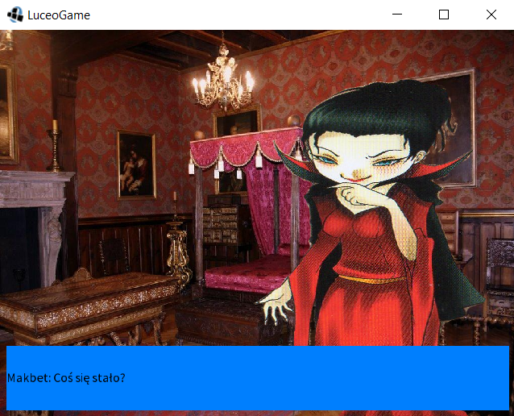
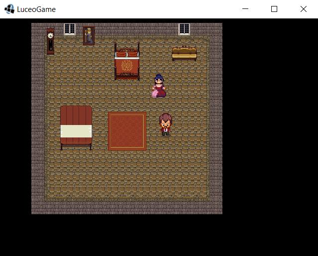
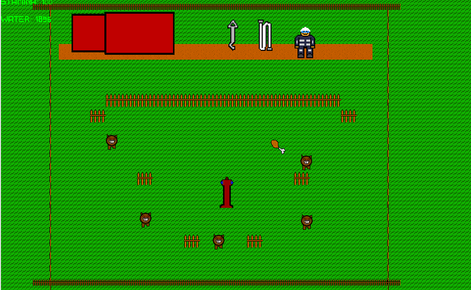
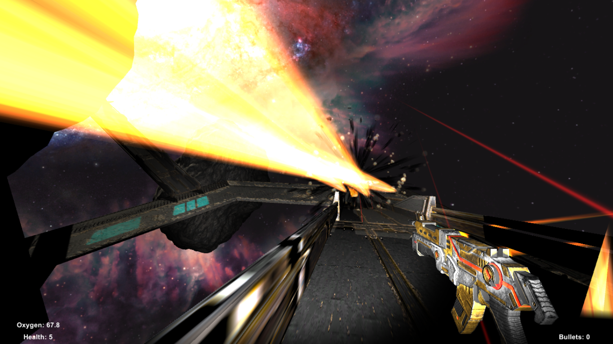
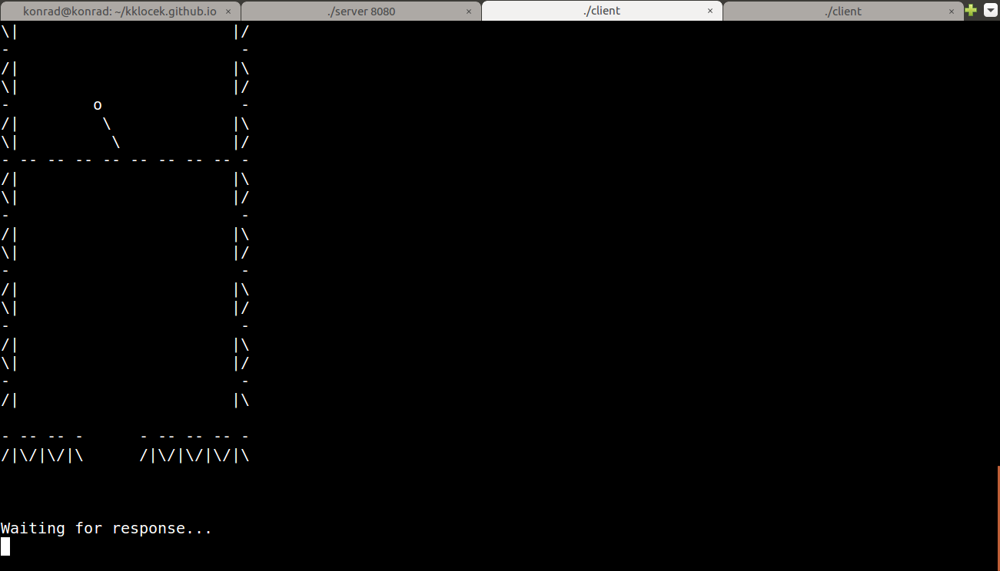

Here are listed some of my side projects, mainly games.. I created my first game when I was 11 (The Games Factory 1.6 was a nice software!), after that I developed some platform games in the Game Maker 6.0. After many breaks I got back into game dev on university.

If you are interested in my other work check my GitHub account [here](https://github.com/kklocek).
Also I invite you to visit my [blog](http://www.konradklocek.com) (for now, content only in Polish...).
### FireVR (codename - in progress) (2017 - 2018)

My MSc thesis ("Using low-cost VR in researching firefighting education based on fire accident simulator") - Google Cardboard simulation which is suited for training volunteer firefighters. Currently in early stage of development.

**Developed with**: Unity

**YouTube demo (June 2017)**: [here](https://www.youtube.com/watch?v=IvGKvphuljE)

### Edugame platform (2016/2017)

My enginneers' thesis - "Educational Game Framework".
Simple game engine built on top of libGDX, where you can make visual novels with player movement. User has only to edit configuration files (in JSON,over 70 parameters to change) to make another game!
Also user can export whole project to Android OS.
Made by 3 developers.

**Made with**: LibGDX + Java

**Screenshot - dialogue system**:

**Screenshot - movement**:

**YouTube demo #1 - education game about chatting with strangers**: [here](https://www.youtube.com/watch?v=DTX4qs2ZeYc)

**YouTube demo #2 - our "Makbet" interpretation as simple visual novel**: [here](https://www.youtube.com/watch?v=m0y6fZlfhCI) 

### Fat Fireman (2017)

My first submission to Ludum Dare :) .

You are a fat firefighter who has to connect hydrant to a firecar, but remember - we are fat and weak.
Game was developed in about 17 hours (~15 hours during event, 2 hours after jam to fix bugs), everything was made by me.

**Made with**: Unity, Tiled, Tiled2Unity, Bosca Cecoil, GIMP

**Screenshot - gameplay**:

**Build (WebGL version)**: [here](https://xqwzts251.itch.io/fat-fireman)

**Ludum Dare 39 entry site**: [here](https://ldjam.com/events/ludum-dare/39/fat-fireman)

### GravityTGK (codename) (2017)

Project for game development course at AGH-UST. Space FPS, where bullets are affected by gravity. Made by 2 developers.

**Made with**: Unity

**Screenshot**:

**Build**: [here](https://www.dropbox.com/s/7yfy182zz8il0yf/GravityTGK.zip?dl=0)

### Pixel Beer Fever (2017)

This is a little game, which was originally entry for #LOWREZJAM 2016 game jam. After jam I spend some time to finish it, and as effect I published it in Google Play.

It's a simple Tapper clone - you are a waiter who serves beers for thirsty clients. All project (incl. assets) made by me.
Game could be very addictive ;) .

**Made with**: LibGDX + Java

**Screenshot**:
 

**Build (Google Play)**: [here](https://play.google.com/store/apps/details?id=com.klocek.lowrez).

**Source**: [here](https://github.com/kklocek/PixelBeerFever)

### SOcCerr (2015)

Project for "Operating systems" course at AGH-UST. Simple terminal pen soccer implementation in C, for 2 players by network. Written in C, with usage of BSD sockets. My first attempt to MMO ;) .

**Made with**: C, just system calls and terminal graphics ;)

**Screenshot**:

**Source**: [here](https://github.com/kklocek/SOcCerr)
